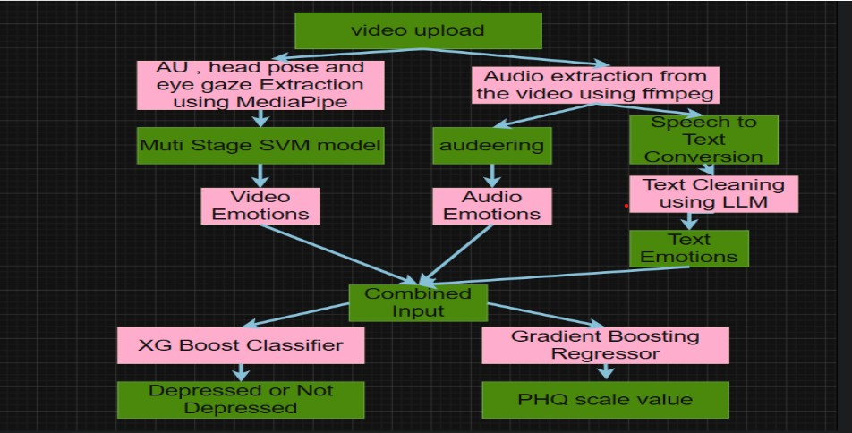
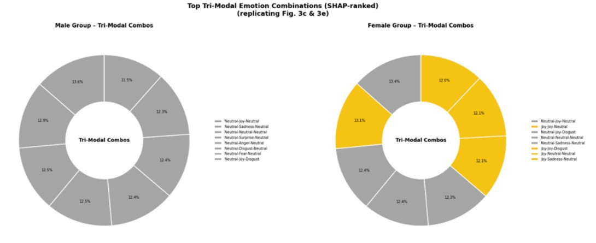
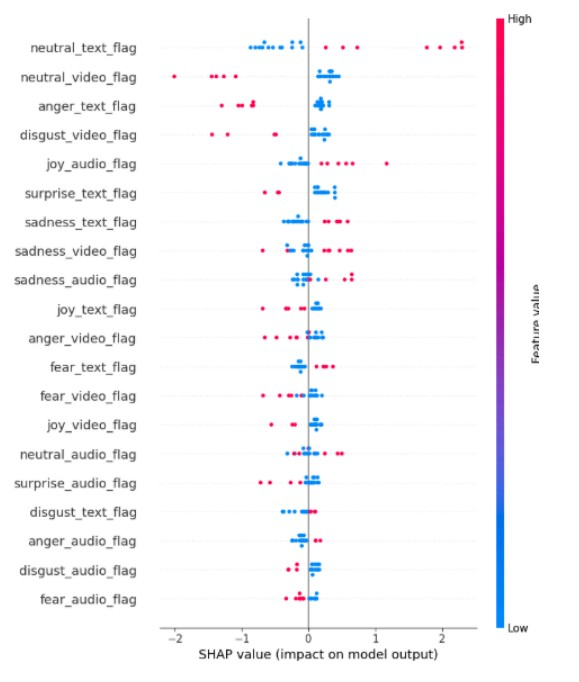
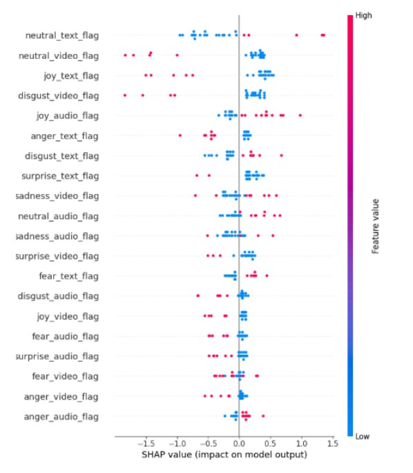

# Tri-Modal Depression Detection Across Gender

## Overview

Depression is a complex mental health condition that manifests through linguistic, acoustic, and visual cues. Traditional depression detection systems often rely on a single modality, limiting their ability to capture the full spectrum of emotional expression.

This project presents a tri-modal depression detection framework that combines text, audio, and visual emotion features to improve depression classification and PHQ score prediction. The system leverages pretrained deep learning models for emotion extraction and employs multimodal feature fusion for downstream prediction tasks.

---

## Problem Statement

Existing depression detection approaches primarily focus on a single source of information such as speech, text, or facial expressions. Such approaches may fail to capture complementary emotional signals and often struggle to generalize across different demographic groups.

This project aims to integrate emotional information from:

* Text transcripts
* Speech audio
* Facial and behavioral visual features

to develop a more robust depression detection framework.

---

## Methodology

### Text Modality

* Transcript preprocessing using Groq LLM
* Emotion extraction using DistilRoBERTa
* Generation of seven emotion probabilities

### Audio Modality

* Audio normalization using Librosa
* Segmentation into fixed-length chunks
* Emotion recognition using Wav2Vec2

### Visual Modality

* Extraction of Action Units, Eye Gaze, and Head Pose features
* Feature selection using Boruta
* Emotion classification using a Hierarchical SVM architecture

### Multimodal Fusion

* Concatenation of emotion probability vectors
* Cross-modal interaction feature engineering
* Depression classification using XGBoost
* PHQ score prediction using Gradient Boosting Regressor

### Explainability

* SHAP-based feature importance analysis
* Gender-specific interpretability analysis

---

## Tech Stack

* Python
* DistilRoBERTa
* Wav2Vec2
* XGBoost
* Scikit-Learn
* SHAP
* BorutaPy
* PyFeat
* Librosa
* NumPy
* Pandas

---

## Dataset

DAIC-WOZ (Distress Analysis Interview Corpus Wizard-of-Oz)

---

## System Architecture




## Explainability Analysis








## Results

| Metric                  | Value  |
| ----------------------- | ------ |
| Classification Accuracy | 77.78% |
| Precision               | 0.833  |
| Recall                  | 0.357  |
| F1 Score                | 0.500  |
| ROC-AUC                 | 0.650  |
| Balanced Accuracy       | 0.662  |

### Gender-wise Performance

| Group  | Accuracy |
| ------ | -------- |
| Female | 75.00%   |
| Male   | 80.95%   |

---

## Repository Structure

```text
trimodal-depression-detection/
│
├── docs/
├── screenshots/
├── src/
├── README.md
├── requirements.txt
└── .gitignore
```

---

## Future Improvements

* Real-time multimodal inference
* Larger and more diverse datasets
* Transformer-based multimodal fusion
* Clinical deployment support
* Improved regression performance

---

## Authors

* Keshaav M
* Robin Savio P
* Sarveswaran

---

## Academic Context

This project was developed as part of the Mini Project (CSE300) course at SASTRA Deemed University.
